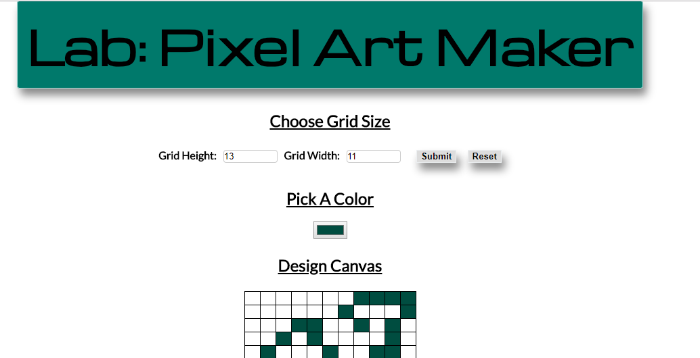

# Pixel-Art Maker

The very basic jQuery web application to make pixels and fill colors in those pixels.
Hold the mouse : mousehovering effect with continous color drawing
single click : adds color

You can also remove colors by double click

Features to be added yet : Saving or downloading the drawing you created and How to use information
_Will be updated_
 
